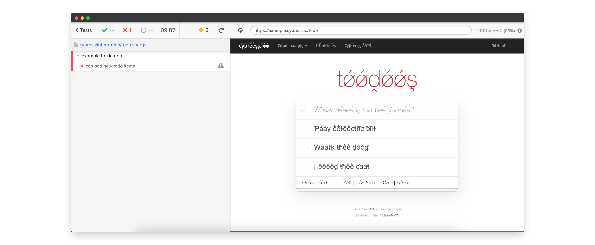

A plugin that allows to transform regular strings into their [pseudo-localized](https://en.wikipedia.org/wiki/Pseudolocalization) variant. It's a wrapper around a small fork of https://github.com/tryggvigy/pseudo-localization.

We highly recommend using this plugin in addition to a [visual regression testing tool](https://docs.cypress.io/plugins/directory#Visual%20Testing).



## Installation

```sh
$ yarn add cypress-pseudo-localization

# or

$ npm i --save cypress-pseudo-localization
```

## In your code

Inside the `cypress/support/commands.js` file, add the following at the top:

```js
import "cypress-pseudo-localization";
```

And then, in your cypress tests:

```js
beforeEach(() => {
  cy.visit("https://your-page-some-where.com/");
  cy.pseudoLocalize();
});

// Make sure to cleanup the localization after the tests
// Needed, because there's a mutation observer used under the hood
afterEach(cy.stopPseudoLocalize);
```
